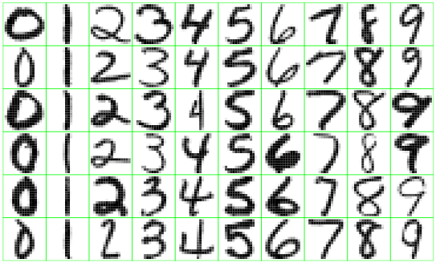

  
## ¿Qué es _Machine Learning_?

_Machine Learning_ es un campo de estudio de algoritmos y modelos matemáticos o estadísticos por medio de los cuales un sistema puede "aprender" de un conjunto de datos para realizar una tarea específica, sin la necesidad de programar cómo se debe realizar dicha tarea específicamente. Tiene aplicaciones en visión artificial, sistemas autónomos, detección de fraude, _pricing_ automático, etc.

Está intimamente relacionado con otros campos como Estadística, Optimización Matemática, Teoría de la Información, y Minería de Datos, de los cuales toma herramientas, teoría o métodos para el diseño y optimización de algoritmos o modelos. En particular, existe una estrecha relación con la Estadística, al grado tal que [algunos expertos](https://www.reddit.com/r/MachineLearning/comments/2fxi6v/ama_michael_i_jordan/ckelmtt/?context=3) no consideran que exista diferencia alguna entre ambos.

Existen tres (o más) principales "tipos" de _Machine Learning_:

* Aprendizaje supervisado (_Supervised Learning_)
* Aprendizaje no supervisado (_Unsupervised Learning_)
* Aprendizaje por refuerzo (_Reinforcement Learning_)

## Aprendizaje supervisado

En el aprendizaje supervisado buscamos predecir una variable en particular (comúnmente llamada **salida** o **respuesta**) a partir de un conjunto de otras variables (de **entrada**) y una serie de ejemplos de ambas. El objetivo es, a partir, de estos ejemplos, producir un modelo o algoritmo capaz de encontrar el valor (estimado) de la variable de respuesta a partir de nuevos ejemplos.

**Ejemplo: Desempeño de un coche**

```{r}
library(ggplot2)
library(ISLR)
# Esta gráfica se conoce como histograma
ggplot(Auto, aes(x=mpg)) + geom_histogram(binwidth=2) + theme_light()
```

En este ejemplo, el problema consiste en estimar el desmpeño de un coche (en millas por galón) a partir de algunas de sus características, como el número de cilindros (cylinders) el peso (weight) o el año de manufactura (year).

```{r}
ggplot(Auto, aes(x=weight, y=mpg)) + geom_point() + theme_light() + ggtitle("Peso vs MPG")
```

En esta gráfica podemos observar la relación peso contra desempeño. Este tipo de relaciones sencillas pueden ser capturadas por un algoritmo o modelo para poder producir estimaciones certeras

```{r}
ggplot(Auto, aes(x=year, y=mpg)) + geom_point() + theme_light() + ggtitle("Peso vs MPG")
```

En general, mientras más variables de entrada encontremos con relaciones más claras, más fácil será estimar (o predecir) la variable de respuesta.

**Ejemplo: Dígitos a mano**



En este ejemplo, podemos entrenar (ajustar) un modelo de ML para encontrar qué dígito es el escrito en estas imágenes, **a partir sólo de las etiquetas correctas y las imágenes mismas**. Para esto necesitamos algoritmos que puedan descubrir relaciones un poco más complejas que las mostradas en el ejemplo anterior.

## Aprendizaje no supervisado

En el aprendizaje no supervisado, **no poseemos** etiquetas "correctas" a partir de las cuales estimar o encontrar alguna variable de salida. Por lo tanto, este enfoque no se basa en la predicción, sino en el descubrimiento de **estructura** en los datos.

**Ejemplo: Análisis de grupos**

Un caso específico de este tipo de aprendizaje es la búsqueda de **grupos** o **cúmulos**. En este análisis el objetivo es dividir en varios grupos un conjunto de datos.


En esta imagen se muestran varios ejemplos de datos a agrupar, aplicando diferentes algoritmos, con diferentes resultados. No existe una sola respuesta correcta, ni un algoritmo que sea estrictamente mejor que los demás en todos los casos.

**Ejemplo: Reglas de asociación**

Otro ejemplo de aprendizaje no supervisado es la búsqueda de **reglas de asociación**. En este tipo de problema intentamos encontrar patrones comunes en un conjunto de datos, por ejemplo, que productos se compran juntos, o qué valor suele tomar una variable una vez que conocemos otras más.


Por ejemplo, este es un mapa de reglas entre productos comprados en un supermercado, el tamaño del círculo indica la frecuencia de compra del par de artículos, mientras que el color del círculo denota la "fuerza" de la asociación.

## Aprendizaje por refuerzo

Un tercer enfoque, el aprendizaje por refuerzo (RL) se basa en la idea de **optimizar la recompensa** que recibe un agente por actuar de cierta manera en un ambiente. Esta formulación general nos permite resolver una gran cantidad de problemas que serían difíciles (o imposibles) de formular como un problema de aprendizaje supervisado o no supervisado. Sin embargo, existen ciertas condiciones para poder abordar un problema como aprendizaje por refuerzo.

En general, los métodos de aprendizaje por refuerzo se basan en descubrir o estimar que **tan valiosa es una acción** dado el **estado del ambiente**, el agente intenta optimizar su siguiente acción basandose en estas estimaciones, que incluyen tanto consecuencias a corto como largo plazo.

**Ejemplo: [Juegos de Atari](https://www.youtube.com/watch?v=4MlZncshy1Q)**

Podemos observar como el agente aprende a jugar Pac-Man a través de experimentar repetidas veces el juego. En este caso, los datos utilizados para el entrenamiento se toman directamente de las experiencias del agente. Esto nos permite entrenar sin necesidad de poseer datos de antemano, siempre y cuando podamos experimentar el ambiente en repetidas ocasiones.

**Ejemplo: [Caminata autónoma](https://www.youtube.com/watch?v=gn4nRCC9TwQ)**

Un ejemplo similar al anterior, en dónde, a través del control de los músculos y articulaciones, un agente aprende a caminar dentro de una simulación. Es importante señalar las limitaciones de este paradigma de ML, ya que búsquedas sencillas o programación directa a menudo [derrotan](https://www.youtube.com/watch?v=vjSohj-Iclc) a los algoritmos de RL en algunos problemas.

## Riesgos: Interpretabilidad y ética

Uno de los temas que a menudo se deja de lado en el estudio de ML es el de la **interpretabilidad**. La interpretabilidad se refiere a qué tan fácil es producir una explicación de por qué el modelo de ML tiene cierta salida, dado cierto conjunto de datos. 

De manera general, mientras más "sencillo" sea un modelo, sus alida es más fácil de interpretar. Sin embargo, dicha sencillez le impedirá ajustarse a casos o fenómenos más complejos. Por ejemplo, en la imagen se muestra un árbol de decisión sencillo para clasificar a una persona como Hombre o Mujer dado su peso y estatura. Si bien esta regla general funciona en muchos casos, hay muchas más variables que nos pueden ayudar a determinar con mayor precisión la clasificación correcta, con el _tradeoff_ de hacer más complejo nuestro modelo.


Otro tipo de interpretabilidad se puede dar cuando podemos **explicar exactamente** como se produce la estimación o predicción, como en el caso de regresión lineal. 


Sin embargo, aunque a veces existe una ecuación exacta que explica nuestro algoritmo, la complejidad de la misma puede resultar en un modelo poco interpretable.


La interpretabilidad es un aspecto muy importante de los modelos de ML, sobre todo para **problemas relacionados con finanzas** como otorgamiento de líneas de crédito, detección de fraudes o segmentación de clientes. Es un imperativo ético ser capaz de explicar por qué se toman decisiones acerca de las finanzas de los clientes, y los modelos de ML más complicados tienen problemas para esto. 

Afortunadamente, existen algunas herramientas capaces de proveer **interpretaciones aproximadas** de cualquier modelo de ML supervisado, por ejemplo, LIME es una técnica donde el modelo complejo es aproximado a través de un modelo sencillo, pero interpretable.

Por último, es importante tener en cuenta el **sesgo inherente** en los datos, para evitar cometer faltas éticas al ignorar el proceso generador de datos, que puede estar sesgado a beneficiar a ciertos segmentos de los usuarios o la población (e.g. otorgamiento de becas, otorgamiento de créditos).
